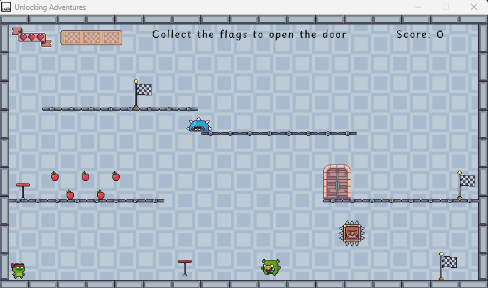
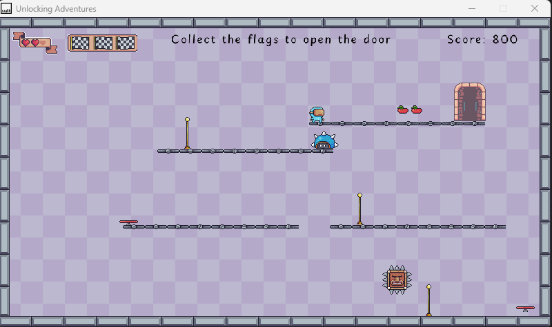
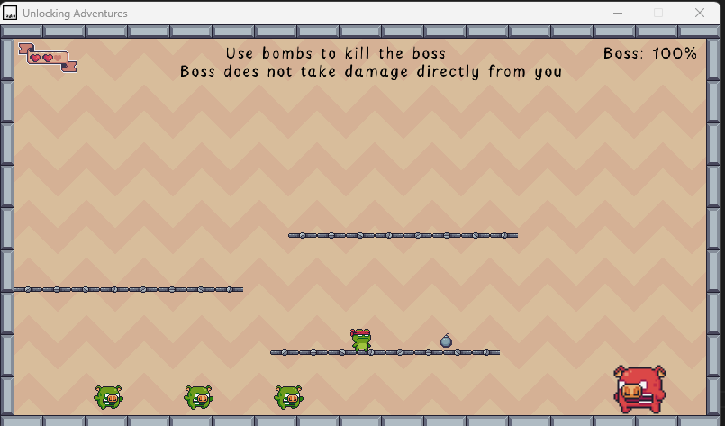

# Unlocking Adventures

## Software Engineering - CA1

### Description

Unlocking Adventures is an adventure game in 2D, the objective is collect flags in each level to open the door to go to next level.

Current there is 3 standars levels and one boss level.

The player has 4 lifes in total and no possibility of getting more lifes or continue. Once all lifes are used it's game over and the player has to start again.

## Controls

#### Keyboard Only:

- A / D or arrow keys LEFT / RIGHT -> Move the character
- W or UP key or SPACE -> Jump
- M -> mute the music

## Screenshots

## References

- Font
  - [Playpen Sans](https://fonts.google.com/specimen/Playpen+Sans)
- Textures
  - [Pixel Adventure 1](https://pixelfrog-assets.itch.io/pixel-adventure-1)
  - [Pixel Adventure 2](https://pixelfrog-assets.itch.io/pixel-adventure-2)
- Sounds
  - [41 Short, Loopable Background Music Files](https://joshuuu.itch.io/short-loopable-background-music)
  - [200 Free SFX](https://kronbits.itch.io/freesfx)
  - [8-BIT Jumping Sounds by Jalastram](https://jalastram.itch.io/8-bit-jump-sound-effects)
- Code (_NOTE: used just as a reference to better understand Raylib and build my own, no pieces of code was copied from the links below_)
  - [Raylib Games](https://github.com/raysan5/raylib-games)
  - [Classy Clash](https://github.com/Chantelsky/classy-clash)
  - [Kea Sigma Delta Raylib 2D Challenge](https://keasigmadelta.com/blog/tag/raylib-2d-challenge)
  - [Rayblib Cheatsheet](https://www.raylib.com/cheatsheet/cheatsheet.html)
- Logo
  - [Hatchful by Shopify](https://www.shopify.com/tools/logo-maker)
